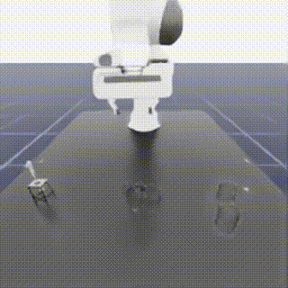

# LabAutoVLA
- GPU-accelerated simulation environment using NVIDIA Isaac Sim and Isaac Lab framework for realistic lab automation tasks 
- VLA fine-tuning framework (SmolVLA with behavior cloning) integrated with simulation assets

## Install
1. Install Isaacsim and Isaaclab
```bash
cd C:\isaacsim5.1
post_install.bat
C:\isaacsim5.1\python -m pip install -e isaaclab_path\source\isaaclab
C:\isaacsim5.1\python -m pip install -e isaaclab_path\source\isaaclab_tasks
# note the version of these packages: usd-core==25.5, lxml==4.9.2, h5py==3.15.1
```
2. Install matterix source in editable mode
```bash
C:\isaacsim5.1\python -m pip install -e .\source\*
```

3. Install other requirements
```bash
C:\isaacsim5.1\python -m pip install -r requirements.txt --no-deps # Avoid conflicts
# Cuda torch should work after Isaaclab installation. If it fails, reinstall with: 
C:\isaacsim5.1\python -m pip install torch==2.7.0 torchvision==0.22.0 --index-url https://download.pytorch.org/whl/cu128
```

4. Set PATH
```bash
$env:MATTERIX_PATH = "[your_project_path]\LabAutoVLA"
```
## Simulation Demo



## Modeling

### Dataset Generation (Synthetic Data)

Generate high-quality training datasets directly from simulation with automatic language variation and domain randomization:

#### Single Task (Pipetting, 1000 episodes):
```bash
C:\isaacsim5.1\python -m data.generate_dataset generation.tasks=[pipetting] \
  generation.num_episodes=1000 generation.num_envs=4
```

**Output:** `data/datasets/pipetting_v1/`
- `data.parquet` — main dataset with observation, action, task language
- `videos/observation.images.overhead.mp4` — trajectory videos (compressed)
- `generation_metadata.json` — generation parameters and statistics

#### Multi-Task (Balanced, 600 total episodes):
```bash
run_isaac_python.bat -m data.generate_dataset \
  generation.tasks=[pipetting,beaker_pick,tip_eject] \
  generation.num_episodes=600 \
  generation.num_envs=4 \
  generation.seed=42
```

**Output:** `data/datasets/multi_task_v1/` (merged dataset)
- All tasks combined with `task_type` field for filtering
- Balanced: ~200 episodes per task

#### Multi-Task (Weighted, 400+200 episodes):
```bash
run_isaac_python.bat -m data.generate_dataset \
  generation.tasks=[pipetting,beaker_pick] \
  'generation.episodes_per_task={pipetting:400,beaker_pick:200}' \
  generation.num_envs=4
```


**Parquet columns:**
- `observation.state`: (D_state,) float32 — proprioceptive state (EE pos + quat + gripper)
- `observation.images.overhead`: video — camera frames (referenced in MP4)
- `action`: (8,) float32 — Franka IK action (EE pos, rot, gripper)
- `task`: str — language instruction (different for every episode)
- `task_type`: str — task ID (for multi-task datasets)

#### Training on Generated Data

```bash
# Single task
run_isaac_python.bat scripts\train.py \
  mode=bc model=smolvla task=pipetting \
  dataset.root=data/datasets/pipetting_v1

# Multi-task (trains on all tasks simultaneously)
run_isaac_python.bat scripts\train.py \
  mode=bc model=smolvla task=pipetting \
  dataset.root=data/datasets/multi_task_v1
```

---

### Alternative: Record Manual Demos

1. Record demos with existing workflow:
   ```bash
   run_isaac_python.bat scripts\run_workflow.py \
     --task LabAuto-Test-Pipetting-Franka-v1 \
     --workflow pipette_liquid --num_envs 1 --save_video --headless
   ```

---